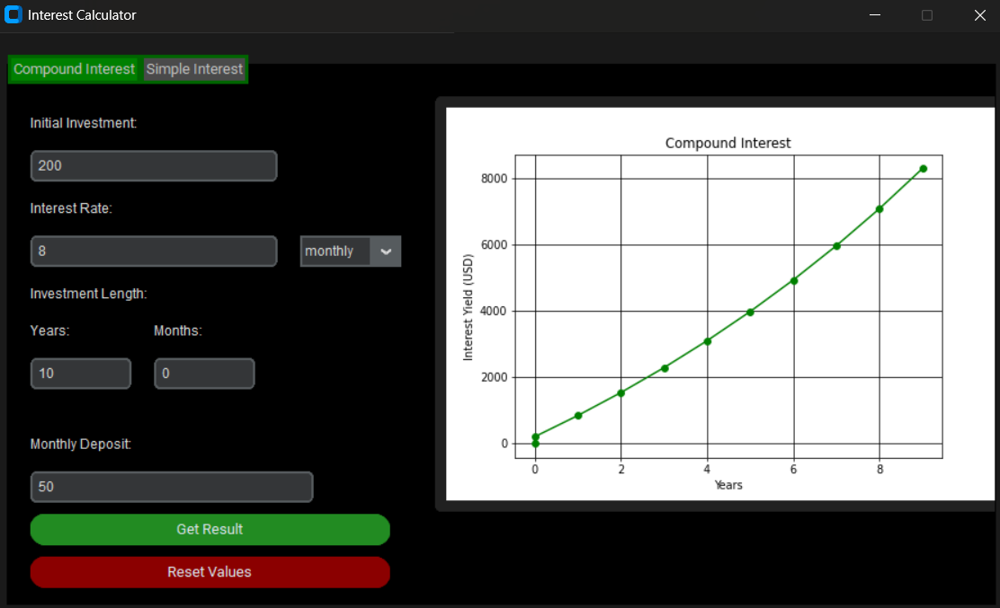

# Investment Tracker

A simple investment tracker made with customtkinter that perform simple and compound interest calculations and graphs the result.

## Features
- Perform compound interest calculation (USD)
- Performs simple interest calculation (USD)

## Requirements
- Ran on Python3.12
- MatPlotlib, customtkinter, tkinter libraries required

## Usage
- Run Investment_Tracker.py on local device
- Can convert .py file into a GUI app to run on local device

## Considerations
- Code can be modified to account for other curriencies
- Investment yield could be embedded into the app interface
